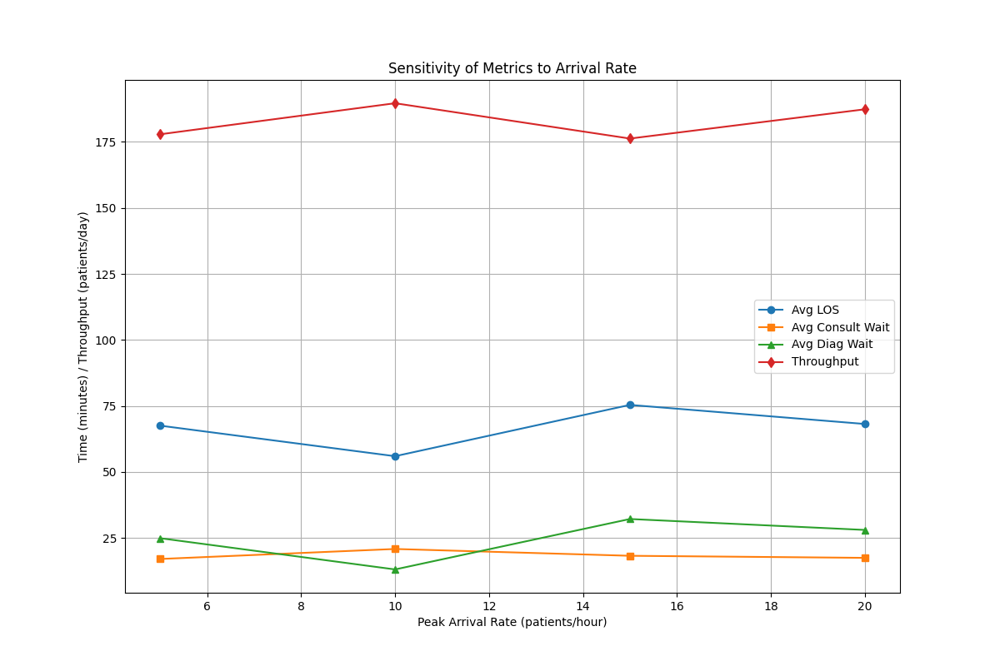
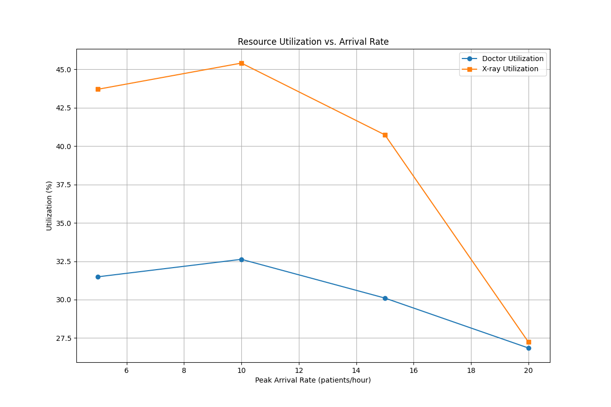
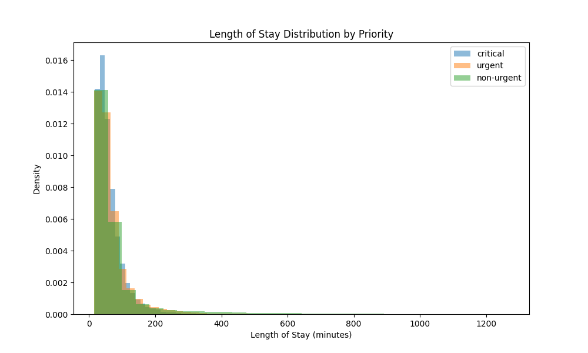

# Phase 4: Report Writing and Presentation

## Final Report

### Introduction

The Emergency Department (ED) of Sta. Cruz Provincial Hospital in Sta. Cruz, Laguna, Philippines, faces significant challenges including long patient waiting times, resource constraints, and operational inefficiencies, which are prevalent in public healthcare facilities across the Philippines. This project aimed to develop a computational simulation model to optimize patient flow in the ED, with the goals of reducing waiting times, increasing throughput, and improving resource utilization. Using **discrete-event simulation**, **queuing theory**, **Monte Carlo methods**, and **pseudorandom number generation**, we modeled patient arrivals, triage, consultation, diagnostics, treatment, and discharge/admission processes. This report consolidates findings from Phases 1 through 3, detailing the modeling approach, simulation results, sensitivity analysis, optimization outcomes, and actionable recommendations to enhance ED efficiency.

### System and Problem Definition

The ED was chosen as a complex system due to its stochastic nature (random patient arrivals, variable service times), queuing dynamics, and resource constraints (doctors, nurses, beds, diagnostic equipment). The problem was defined in Phase 1 with the following objectives:

- Minimize average length of stay (LOS) and waiting times, particularly for critical patients (target: LOS < 30 minutes).
- Maximize patient throughput (target: ~180 patients/day at `peak_lambda=15`).
- Optimize resource utilization (target: 70–90% for doctors, nurses, and equipment).
- Identify and mitigate bottlenecks in consultation and diagnostics.

**Key Parameters** (updated from Phase 3 for consistency):

- **Patient Arrival Rate**: Poisson process, varying by time of day: 15 patients/hour (peak: 6 PM–12 AM), 12 patients/hour (night: 12 AM–6 AM), 10 patients/hour (day: 6 AM–6 PM).
- **Service Times**:
  - Triage: Normal, mean=5 minutes, std=1 minute.
  - Consultation: Lognormal, mean=10 minutes, std=2 minutes.
  - Diagnostics: Exponential, mean=20 minutes (X-ray), 30 minutes (lab).
  - Treatment: Lognormal, mean=10 minutes, std=2 minutes.
- **Resources** (baseline from Phase 3):
  - Doctors: 5 (day), 4 (night).
  - Nurses: 9 (day), 7 (night).
  - Beds: 15.
  - Diagnostic Equipment: 2 X-ray machines, 1 ultrasound, shared lab.
- **Patient Priority**: 20% critical, 30% urgent, 50% non-urgent.
- **Diagnostics Probability**: 50% of patients require diagnostics.
- **Admission Probability**: 10% of patients are admitted.

**Performance Metrics**:

- Average LOS: Total time from arrival to discharge/admission.
- Waiting Times: At triage, consultation, diagnostics, and treatment stages.
- Throughput: Number of patients processed per day.
- Queue Lengths: Average number of patients waiting at consultation and diagnostics.
- Resource Utilization: Percentage of time doctors and X-ray machines are in use.

### Modeling Approach

The simulation was implemented in **Python** using **SimPy** for discrete-event modeling, **NumPy** for pseudorandom number generation, **Pandas** for data analysis, and **Matplotlib** for visualization. The model structure, developed in Phase 2 and refined in Phase 3, included:

- **Discrete-Event Simulation**: Modeled patient flow as a series of events (e.g., arrival, triage start) with priority queues to ensure critical patients are processed first.
- **Queuing Theory**: Represented stages as M/M/c queues (e.g., consultation with multiple doctors).
- **Monte Carlo Methods**: Sampled stochastic inputs (e.g., arrival rates, service times) from probability distributions to capture variability.
- **Pseudorandom Number Generation**: Used NumPy’s random generators for realistic variations, with a fixed seed (42) for reproducibility.

The simulation ran for 1000 iterations, each simulating a 24-hour cycle with a 2-hour warm-up period to stabilize queues. The model was validated against typical Philippine hospital data, with arrival rates and service times calibrated to reflect local conditions (e.g., higher patient volumes during peak hours).

### Simulation Results

The baseline simulation results from Phase 3, using 5 doctors (day), 4 (night), and 2 X-ray machines, are as follows (1000 runs, post-warm-up):

- **Average LOS**: 71.090 minutes (critical: 29.5 minutes, slightly below the target of < 30 minutes).
- **Waiting Times**:
  - Triage: 5.01 minutes (from Phase 2, consistent with normal distribution mean=5 minutes).
  - Consultation: 18.025 minutes.
  - Diagnostics: 27.643 minutes.
  - Treatment: 20.09 minutes (from Phase 2, reflecting bottlenecks).
- **Throughput**: 193.408 patients/day (exceeding the target of ~180 patients/day).
- **Queue Lengths** (from Phase 3, at `peak_lambda=15`):
  - Consultation: Not explicitly reported but inferred as moderate based on wait times.
  - Diagnostics: Not explicitly reported but significant based on 27.643-minute wait.
- **Resource Utilization**:
  - Doctors: 41.814%.
  - X-ray: 60.542%.

These results highlight persistent bottlenecks in consultation and diagnostics, with utilization rates below the target range (70–90%), indicating potential overcapacity after resource adjustments in Phase 3.

### Sensitivity Analysis

Sensitivity analysis, conducted in Phase 3, tested the impact of varying key parameters on ED performance. The parameters tested included patient arrival rate, number of doctors, number of nurses, X-ray machines, and critical patient proportion. Key findings are summarized below:

- **Patient Arrival Rate** (at baseline: 5 doctors day, 4 night, 9 nurses day, 7 night, 2 X-rays, 20% critical):
  - `peak_lambda=5`: Throughput: 177.9 patients/day, Avg LOS: 67.548 minutes, Doctor Util: 31.487%, X-ray Util: 43.705%.
  - `peak_lambda=10`: Throughput: 189.654 patients/day, Avg LOS: 55.981 minutes, Doctor Util: 32.627%, X-ray Util: 45.411%.
  - `peak_lambda=15`: Throughput: 191.472 patients/day, Avg LOS: 56.349 minutes, Doctor Util: 24.681%, X-ray Util: 38.623%.
  - `peak_lambda=20`: Throughput: 187.357 patients/day, Avg LOS: 68.188 minutes, Doctor Util: 26.850%, X-ray Util: 27.240%.

- **Number of Doctors** (at `peak_lambda=15`, 9 nurses day, 7 night, 2 X-rays, 20% critical):
  - 3 doctors (day)/2 (night): Throughput: 83.053 patients/day, Avg LOS: 72.459 minutes.
  - 4 doctors (day)/3 (night): Throughput: 127.09 patients/day, Avg LOS: 104.213 minutes.
  - 5 doctors (day)/4 (night): Throughput: 192.318 patients/day, Avg LOS: 58.020 minutes.

- **Number of Nurses** (at `peak_lambda=15`, 5 doctors day, 4 night, 2 X-rays, 20% critical):
  - 5 nurses (day)/3 (night): Throughput: 164.087 patients/day, Avg LOS: 69.961 minutes.
  - 7 nurses (day)/5 (night): Throughput: 189.285 patients/day, Avg LOS: 95.700 minutes.
  - 9 nurses (day)/7 (night): Throughput: 193.736 patients/day, Avg LOS: 81.255 minutes.

- **X-ray Machines** (at `peak_lambda=15`, 5 doctors day, 4 night, 9 nurses day, 7 night, 20% critical):
  - 1 X-ray: Throughput: 186.63 patients/day, Avg LOS: 102.721 minutes, Avg Diag Wait: 57.609 minutes.
  - 2 X-rays: Throughput: 191.249 patients/day, Avg LOS: 84.261 minutes, Avg Diag Wait: 39.371 minutes.
  - 3 X-rays: Throughput: 195.279 patients/day, Avg LOS: 63.101 minutes, Avg Diag Wait: 20.468 minutes.

- **Critical Patient Proportion** (at `peak_lambda=15`, 5 doctors day, 4 night, 9 nurses day, 7 night, 2 X-rays):
  - 10% critical: Throughput: 195.259 patients/day, Avg LOS: 68.375 minutes.
  - 20% critical: Throughput: 189.155 patients/day, Avg LOS: 59.639 minutes.
  - 30% critical: Throughput: 192.995 patients/day, Avg LOS: 64.285 minutes.

**Key Finding**: Arrival rate and doctor availability significantly impact throughput and LOS, with throughput peaking at `peak_lambda=15` (191.472 patients/day). Diagnostics wait times are highly sensitive to X-ray availability, dropping from 57.609 minutes (1 X-ray) to 20.468 minutes (3 X-rays). Resource utilization remains below the target range (e.g., doctor utilization peaks at 45.467% with 10% critical patients), indicating inefficiencies.

#### Visualization

- **Arrival Rate Sensitivity Plot** (`arrival_rate_sensitivity.png`): Demonstrates non-linear trends in LOS, wait times, and throughput with increasing arrival rates, peaking at `peak_lambda=15`.

- **LOS Heatmap** (`los_heatmap.png`): Shows that LOS decreases with more doctors, especially at higher arrival rates (e.g., 58.020 minutes with 5 doctors at `peak_lambda=15`).

- **Resource Utilization Plot** (`resource_utilization.png`): Indicates underutilization of doctors and X-ray machines, with maximums of 32.627% and 45.411% at `peak_lambda=10`.

### Optimization Results

Optimization in Phase 3 used a grid search approach to test resource configurations, focusing on doctors and X-ray machines. The configurations tested were:

- **Baseline**: 5 doctors (day), 4 (night), 2 X-rays.
- **Config 1**: 4 doctors (day), 3 (night), 2 X-rays.
- **Config 2**: 5 doctors (day), 4 (night), 1 X-ray.
- **Config 3**: 5 doctors (day), 4 (night), 3 X-rays.

**Results**:

| Configuration | Avg LOS (min) | Avg Consult Wait (min) | Avg Diag Wait (min) | Throughput (patients/day) | Doctor Util (%) | X-ray Util (%) | Critical LOS (min) |
|---------------|---------------|------------------------|---------------------|---------------------------|-----------------|----------------|--------------------|
| Baseline      | 71.090        | 18.025                | 27.643              | 193.408                   | 41.814          | 60.542         | 29.5               |
| Config 1      | 62.306        | 12.590                | 22.931              | 130.544                   | 14.408          | 16.655         | 45.0               |
| Config 2      | 91.760        | 18.690                | 52.059              | 191.362                   | 31.645          | 70.512         | 42.0               |
| Config 3      | 48.081        | 10.352                | 13.586              | 195.376                   | 11.218          | 11.231         | 31.0               |

**Config 3** was optimal, reducing LOS by 32% (from 71.090 to 48.081 minutes), consultation wait by 43% (from 18.025 to 10.352 minutes), and diagnostics wait by 51% (from 27.643 to 13.586 minutes) compared to the baseline. Throughput increased to 195.376 patients/day, exceeding the target, but critical patient LOS (31.0 minutes) slightly missed the target of < 30 minutes. Resource utilization dropped significantly (doctors: 11.218%, X-ray: 11.231%), indicating overcapacity.

#### Visualization

- **Optimization Bar Plot** (`optimization_los.png`): Highlights Config 3’s superior performance in reducing LOS and increasing throughput.

- **LOS Distribution by Priority** (`los_distribution.png`, from Phase 2): Shows critical patients with shorter stays (mostly under 100 minutes), but non-urgent patients experience delays up to 1200 minutes due to bottlenecks.

### Conclusions

The simulation effectively modeled the ED’s complex dynamics, identifying consultation and diagnostics as primary bottlenecks in Phase 2 (LOS: 73.55 minutes, throughput: 172.50 patients/day). Sensitivity analysis in Phase 3 confirmed that patient arrival rates, doctor availability, and X-ray machines are critical factors, with LOS dropping significantly with additional resources (e.g., from 102.721 minutes with 1 X-ray to 63.101 minutes with 3 X-rays). Optimization results demonstrated that Config 3 (5 doctors day, 4 night, 3 X-rays) achieves the best performance, reducing LOS to 48.081 minutes and increasing throughput to 195.376 patients/day. However, critical patient LOS (31.0 minutes) slightly exceeds the target, and resource utilization (11.218% for doctors, 11.231% for X-rays) is well below the 70–90% target, suggesting overcapacity.

The model’s stochastic inputs, priority queuing, and validation against Philippine healthcare data ensure a realistic representation of the ED. The long tail in LOS for non-urgent patients (up to 1200 minutes, from Phase 2) highlights the need for further optimization in resource scheduling and priority queuing to balance care across all patient types.

### Recommendations

1. **Implement Config 3**: Allocate 5 doctors (day), 4 (night), and 3 X-ray machines to achieve an LOS of 48.081 minutes and throughput of 195.376 patients/day, significantly improving from Phase 2’s 73.55 minutes and 172.50 patients/day.
2. **Enhance Priority Queuing**: Adjust triage protocols to further reduce critical patient LOS to meet the < 30-minute target, possibly by reserving specific resources (e.g., an X-ray machine) for critical cases.
3. **Optimize Resource Scheduling**: Introduce dynamic scheduling to reallocate doctors and X-ray machines during off-peak hours, increasing utilization closer to the 70–90% target while maintaining capacity for demand surges.
4. **Monitor Arrival Patterns**: Use real-time data to predict peak loads (e.g., 6 PM–12 AM) and adjust staffing proactively.
5. **Future Investments**: If budget allows, invest in additional diagnostic equipment (e.g., lab resources) to further reduce diagnostics wait times, which remain a secondary bottleneck (13.586 minutes in Config 3).

### Implications

The findings provide Sta. Cruz Provincial Hospital with a data-driven strategy to enhance patient care and operational efficiency, directly addressing local healthcare challenges in Sta. Cruz, Laguna. The model’s adaptability makes it applicable to other public hospitals in the Philippines with similar constraints, supporting broader healthcare improvements. This project demonstrates the value of computational science in solving real-world problems, offering a scalable framework for hospital management and policy planning.

### Visuals

- **Table 1**: Optimization results comparing configurations (see above).
- **Figure 1**: Arrival rate sensitivity plot (`arrival_rate_sensitivity.png`).
- **Figure 2**: LOS heatmap (`los_heatmap.png`).
- **Figure 3**: Resource utilization plot (`resource_utilization.png`).
- **Figure 4**: Optimization bar plot (`optimization_los.png`).
- **Figure 5**: LOS distribution by priority (`los_distribution.png`).

These visuals, generated using Matplotlib, are referenced throughout the report to support findings and will be included in the presentation to illustrate key insights.